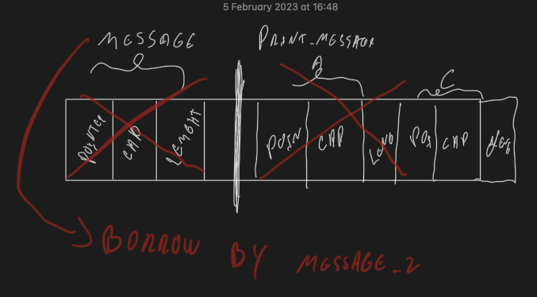

Allocated numbers and String are bit different.

Compiler knows how much space i need for my integers, but string ( array of char ) dont have a fixed size.

## Code Example

```rust
fn main() {
    let a = 10;
    let b = a; // copying
    let c = 10;
    let message = String::from("Hello");
}
```

## Stack frame

| let a | let b | let c | message | message  | message |
|:-----:|:-----:|:-----:|:-------:|:--------:|:-------:|
|  10   |  10   |  15   | Pointer | Capacity | Length  |

## Heap Memory

Pointer => addresss in memory => "Hello"

Capacity => How much memory => 5

Length => 5

|  H  |  e  |  l  |    l    |    o     |
|:---:|:---:|:---:|:-------:|:--------:|


```rust
fn main() {
    let a = 10;
    let b = a; // copying
    let c = 10;
    let message = String::from("Hello");
    let message_2 = message;

    println!("{}", message);
}
```

After use message_2 = message, we move string to another variable with same pointer.

```bash
println!("{}", message);
              ^^^^^^^ value borrowed here after move
```

Same inside function:

Example code on heap_string_move.rs

What happen:

